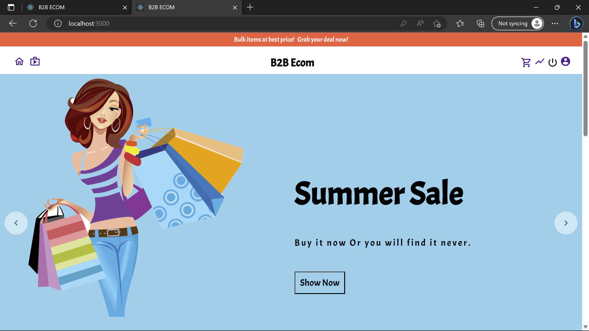
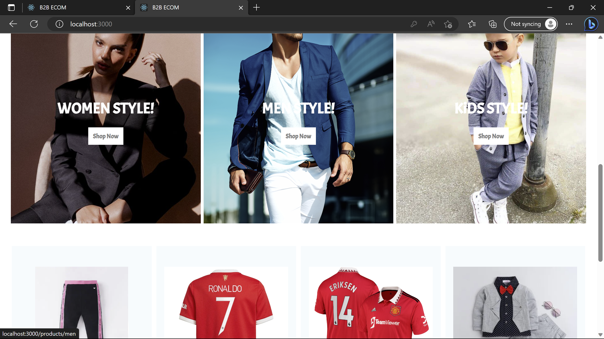

# B2B-Ecommerce

## Prerequisites 
1. Node Js
2. MongoDB URL
3. Firebase Web Project Configuration 

<picture> </picture>
<picture> </picture>

## How to Run

1. After Cloning navigate to each folder(Client, API, Admin) via `cd <Folder_Name>` 
2. Install npm pakages by running the command `npm i` or `npm install --legacy-peer-deps`  
3. Run the command `npm start` in all the folders cmd to run the code. (For admin side navigate to '/login' to view the site.)
